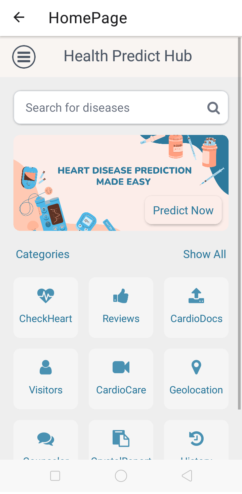
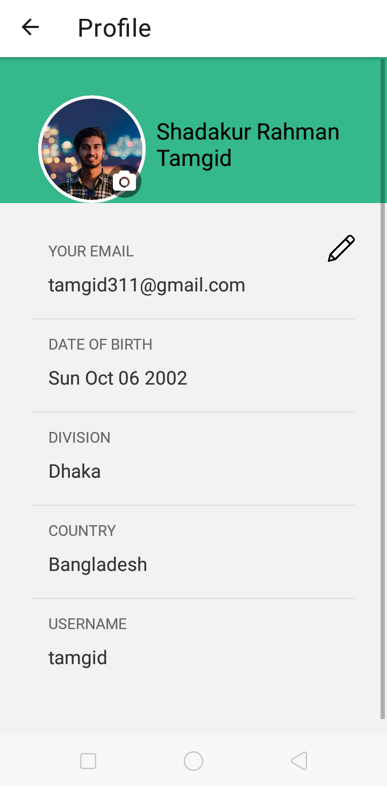
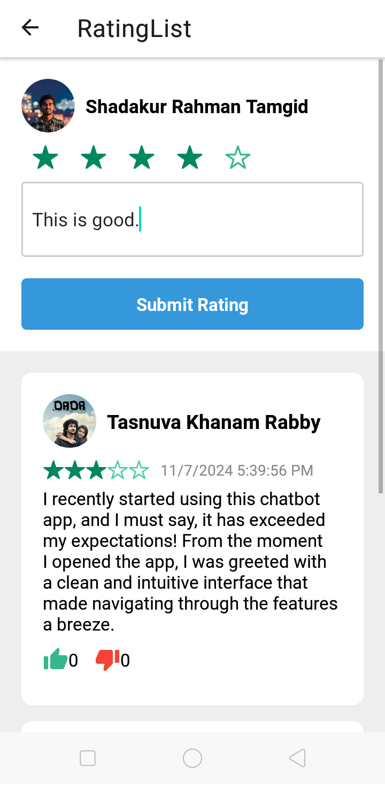
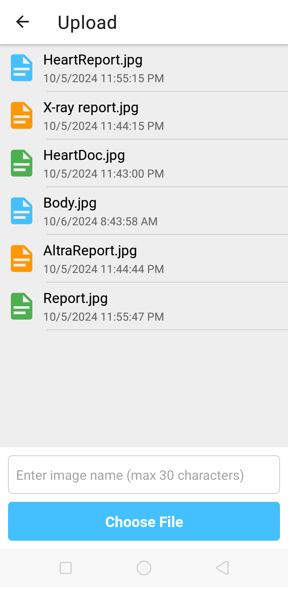
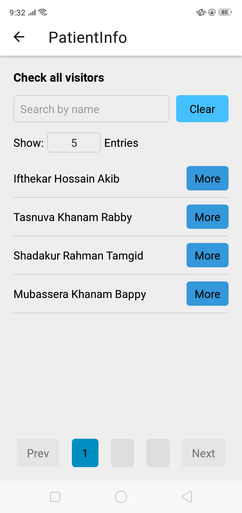

# Heart Disease Prediction App

An advanced mobile application built with **React Native** and powered by **machine learning** to predict the likelihood of heart disease. This app integrates a Logistic Regression model deployed on Render and provides real-time predictions and various user-focused features, including authentication, interactive rating, and more. Developed with Firebase, GraphQL, and other modern tools, this app offers a seamless and engaging user experience.

## 📋 Project Overview

The Heart Disease Prediction App is designed to assist users in understanding potential heart disease risks based on their input. With more than 80% model accuracy, the app offers reliable predictions and is suitable for educational and awareness purposes.

---

## 🚀 Features

- **Heart Disease Prediction**: Real-time predictions using a Logistic Regression model with 80%+ accuracy.
- **Authentication & Authorization**: Secure login, registration, and password management with Firebase.
- **Interactive UI**: User-friendly UI built with React Native Expo.
- **Real-time Features**:
  - Commenting system (similar to Facebook) without page reload.
  - Unique username verification during registration.
- **Engagement Tools**:
  - Like, dislike, and rating features for posts.
  - Real-time Google Map for tracking user location and embedding points of interest.
- **Media and File Upload**: Capability to upload and display images and videos.
- **GraphQL Integration**: For efficient data querying.
- **RESTful API Access**: Integration with external data sources.
- **Modern Animations**: Using GSAP for interactive user experience.
- **Machine Learning**: TensorFlow Lite model for real-time predictions.

---

## 🛠️ Tech Stack

### **Frontend**
- **React Native Expo**: Cross-platform mobile app development.
- **React Navigation**: Stack and tab-based navigation.
- **GSAP**: For animations.
- **Material Bottom Tabs**: Interactive navigation UI.

### **Backend & Database**
- **Firebase**: Authentication, Firestore for data storage.
- **TensorFlow Lite**: Deployed logistic regression model.
- **GraphQL**: For efficient API interactions.
- **Render**: Model deployment for real-time access.

### **Other Tools**
- **Git & GitHub**: Version control and collaboration.
- **GraphQL & REST API**: For handling data and third-party integrations.
- **Map API**: Google Maps integration for real-time location.

---

## 📈 Model Overview

The **Logistic Regression model** trained for this project achieved over **80% accuracy** in predicting heart disease. The model is deployed on Render, providing quick responses and integration with TensorFlow Lite for mobile compatibility.

## 📸 Screenshots

### This is the main entry point of the app


### Sign in to your account to access your dashboard.


### Home page with quick links to all essential features.


### This is the Sidebar


### Your personal profile information and settings.


### This is our model performance


### Browse through user ratings and reviews.


### Upload documents securely for record-keeping.


### Detailed information on individual patients.


### Chat with our health bot for quick advice.


---

## 📂 Project Structure

    ├── assets/               # App assets (icons, some images, etc.)
    ├── components/           # Individual components (charts, buttons, etc.)
    ├── image/                # App images (used images, etc.)
    ├── model/                # Trained Machine Learning Model
    ├── pages/                # Individual screens (HomePage, SignIn, CheckHealth, etc.)
    ├── config.js             # Firebase configuration
    ├── App.js                # Main app entry point
    ├── README.md             # Project documentation
    ├── package.json          # Dependency manager
    └── ...

---

## 🔧 Installation & Setup

1. **Clone the repository**:

   ```bash
   git clone https://github.com/tamgid/hph.git
   cd hph

2. **Install dependencies:**:

   ```bash
   npm install

3. **Set up Firebase:**:
   
   - Create a Firebase project and configure authentication.
   - Copy the Firebase configuration into **config.js**
4. **Run the application:**:

   ```bash
   npm start
5. **Model Deployment:**:
   
   - Ensure your model is deployed on Render and accessible via API. Update the model endpoint in **CheckHealth.js** or relevant files.
  
## 📊 Performance & Results

- **Accuracy**: 80%+ on the heart disease dataset.
- **Real-time Prediction Speed**: ~200ms response time.
- **Engagement Metrics**: Built-in like, comment, and rating options to gauge user engagement.

## 📸 Demo

Screenshots and model performance graphs can be found in the `screenshots` folder.

## 🤝 Contributing

Feel free to submit pull requests to improve the app’s performance, add features, or fix bugs.

1. Fork the repository.
2. Create a new branch: `git checkout -b feature-branch-name`.
3. Commit your changes: `git commit -m 'feature details'`.
4. Push to the branch: `git push origin feature-branch-name`.
5. Submit a pull request.

## 📝 License

This project is licensed under the MIT License. See `LICENSE` for more information.

---

## 🔗 Contact

For inquiries or collaborations, please reach out on [LinkedIn](https://www.linkedin.com/in/shadakur-rahman-tamgid-7b1a28230/) or open an issue on [GitHub](https://github.com/tamgid/hph/issues).
